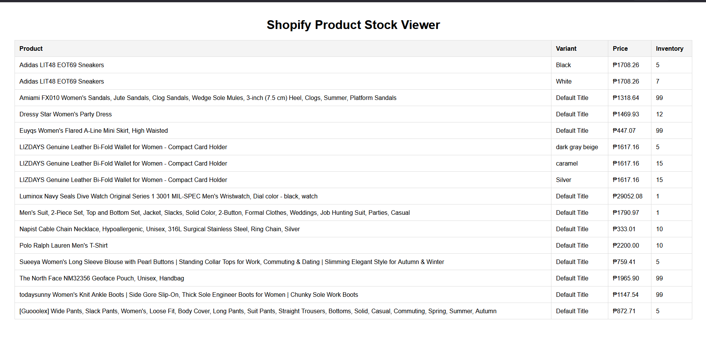

# Shopify Stock Viewer
A simple Flask web application that connects to the Shopify Admin API to display product inventory levels in a clean table format.

## Features
Fetches product data from Shopify API
Displays product variants, prices, and inventory quantities
Easy configuration via environment variables

## Screenshot

*Example output showing product inventory displayed in a table*

## Setup
1. Clone the repo:

    git clone https://github.com/iamRichardG/shopify-stock-viewer.git
    cd shopify-stock-viewer

2. Create a .env file with your Shopify credentials:

    SHOPIFY_API_KEY=your_api_key_here
    SHOPIFY_PASSWORD=your_password_here
    SHOPIFY_STORE_NAME=your_store_name_here

3. Install dependencies 

    pip install -r requirements.txt

4. Run the App 

    python app.py

5. Open in your browser Visit http://127.0.0.1:5000/ 
    to view your Shopify store inventory.
